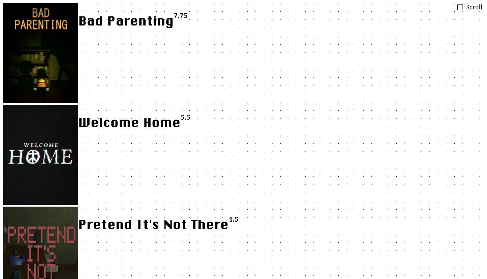

<h1 align="center">ConmanoRatings</h1>

<h6 align="center">All Conmano's favourite media!</h6>

<p align='center'>
    </img>
</p>

<br>

## Custom CSS
Paste these in to modify your OBS source to achieve different settings.
### autoscroll
```css
/* autoscroll CSS without button */
#scrollbox {
  display: none;
}
label[for="scrollbox"] {
  display: none;
}
.list { /* can change speed by changing '10s' */
  animation: autoscroll 10s infinite linear;
}
```

### transparent background
```css
/* transparent background */
body {
  background: transparent !important;
}
```